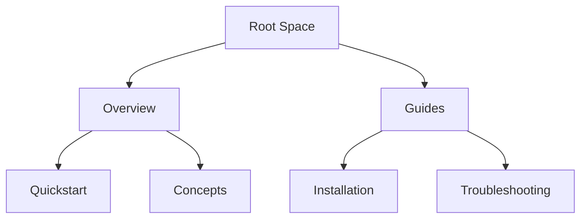

## Overview

Anzhela organizes your project documentation into structured, searchable spaces. You create hierarchies of pages within spaces to manage content efficiently. Master these core concepts to build effective documentation workflows.

<Callout kind="info">
  Start with a single space for your project, then add pages as needed.
</Callout>

## Key Concepts

Use these foundational elements to structure your documentation.

<Columns cols={3}>
  <Card title="Spaces" icon="database">
    Containers for related documentation. Organize by project, team, or topic.
  </Card>
  <Card title="Pages" icon="file-text">
    Individual documents within spaces. Support rich content and nesting.
  </Card>
  <Card title="Hierarchy" icon="layers">
    Nested structure for navigation. Parent-child relationships improve discoverability.
  </Card>
</Columns>

## Creating Pages and Hierarchy

Follow these steps to create and organize pages.

<Steps>
  <Step title="Create a Space" icon="plus">
    Navigate to your dashboard and select "New Space". Enter a name like "API Docs".
  </Step>
  <Step title="Add a Page" icon="file-plus">
    Inside the space, click "New Page". Choose a title and parent page for hierarchy.
  </Step>
  <Step title="Nest Pages" icon="chevron-down">
    Drag pages in the sidebar to create subpages. Use indentation for levels.
  </Step>
</Steps>



## Content Types and Formatting

Anzhela supports multiple content types. Switch between them based on your needs.

<Tabs>
  <Tab title="Markdown" icon="file-text">
    Write structured text with headings, lists, and code blocks.
    
    <CodeGroup tabs="Basic,Advanced">
    ````markdown
    ## Heading
      
    - List item
    - Another item
    ````
    ````markdown
    ## Table Example
      
    | Feature | Description |
    |---------|-------------|
    | Spaces  | Organize docs |
    | Pages   | Nested content |
    ````
    </CodeGroup>
  </Tab>
  <Tab title="Visual" icon="image">
    Embed images, diagrams, and interactive components.
    
    <Image
      src="https://docs.example.com/diagram.png"
      alt="Page hierarchy diagram"
      width="600"
      height="400"
    />
  </Tab>
  <Tab title="API Docs" icon="code">
    Use specialized fields for endpoints and parameters.
    
    <ParamField path="userId" param-type="string" required="true">
      Unique user identifier.
    </ParamField>
    
    <ResponseField name="user" field-type="object" required="true">
      User profile data.
    </ResponseField>
  </Tab>
</Tabs>

## Search and Navigation Fundamentals

<ExpandableGroup>
  <Expandable title="Global Search" default-open="true">
    Search across all spaces using the top bar. Filters refine results by space or type.
    
    <Callout kind="tip">
      Use quotes for exact phrases: `"API authentication"`.
    </Callout>
  </Expandable>
  <Expandable title="Sidebar Navigation">
    Breadcrumbs show your location. Expand/collapse sections for focus.
  </Expandable>
  <Expandable title="Advanced Filters">
    Filter by tags, dates, or authors in search results.
  </Expandable>
</ExpandableGroup>

Master these concepts to scale your documentation. Next, explore [page creation](/quickstart) for hands-on practice.