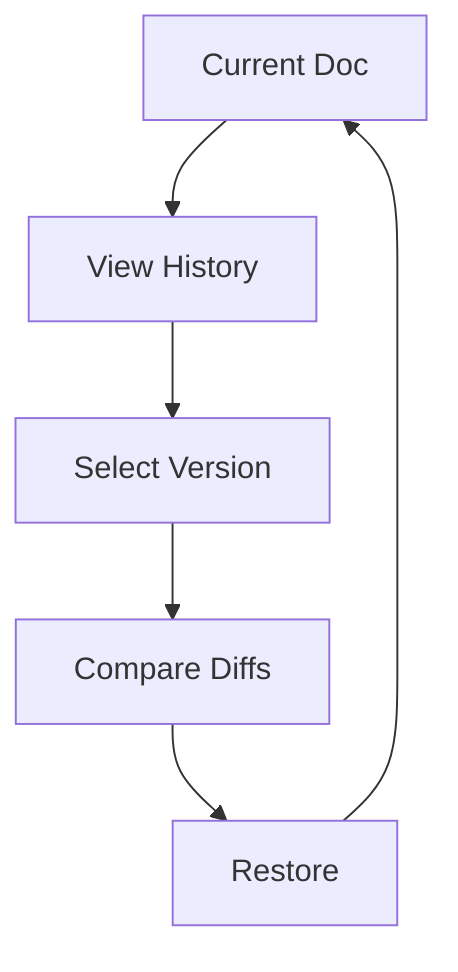

## Overview

Anzhela empowers you to create, manage, and share professional documentation with ease. You get tools for real-time collaboration, automatic version tracking, deep customization, and seamless publishing. This guide walks you through the core features to help you build efficient workflows.

<Columns cols={2}>
  <Card title="Collaboration Tools" icon="users" href="#collaboration">
    Share docs with teams and invite editors instantly.
  </Card>
  <Card title="Version History" icon="git-branch" href="#version-history">
    Track changes and revert with confidence.
  </Card>
  <Card title="Customization" icon="palette" href="#customization">
    Brand your space with colors and themes.
  </Card>
  <Card title="Export & Publish" icon="share-2" href="#export">
    Publish to web or export in multiple formats.
  </Card>
</Columns>

## Collaboration and Sharing Tools

Invite team members to collaborate in real time. You can generate shareable links with view-only or edit permissions.

<Callout kind="tip">
  Use role-based access to control who can edit sensitive docs.
</Callout>

<Steps>
  <Step title="Invite Collaborators" icon="user-plus">
    Navigate to your doc settings and enter email addresses.

    ```
    Members: team@example.com, editor@company.com
    ```
  </Step>
  <Step title="Set Permissions">
    Choose roles: Viewer, Editor, or Admin.
  </Step>
  <Step title="Share Link">
    Copy the public link for instant sharing.
  </Step>
</Steps>

## Version History and Editing

Anzhela automatically saves every change, letting you view diffs and restore previous versions.

<Tabs>
  <Tab title="View History" icon="clock">
    Click the history icon to see a timeline of edits.
  </Tab>
  <Tab title="Compare Versions" icon="git-compare">
    Select two versions to highlight changes.
  </Tab>
  <Tab title="Restore Version" icon="refresh-cw">
    Revert to any prior state with one click.
  </Tab>
</Tabs>



## Customization Options

Tailor your documentation space with brand colors like `#3B82F6` for Anzhela's blue theme. Update settings via the config file.

<CodeGroup tabs="YAML,JSON">
  ```yaml
  theme:
    primaryColor: "#3B82F6"
    logo: "/path/to/logo.svg"
    font: "Inter"
  ```
  ```json
  {
    "theme": {
      "primaryColor": "#3B82F6",
      "logo": "/path/to/logo.svg",
      "font": "Inter"
    }
  }
  ```
</CodeGroup>

<Expandable title="Advanced Theme Options" default-open="false">
  Customize navigation, sidebar, and dark mode toggles for a fully branded experience.
</Expandable>

## Export and Publishing Capabilities

Publish your docs to a custom domain or export as PDF, HTML, or Markdown.

<Request tabs="cURL,JavaScript" show-lines="true">
  ```bash
  curl -X POST https://api.example.com/v1/publish \
    -H "Authorization: Bearer YOUR_API_KEY" \
    -d '{"docId": "doc-123", "format": "html"}'
  ```
  ```javascript
  const response = await fetch('https://api.example.com/v1/publish', {
    method: 'POST',
    headers: {
      'Authorization': 'Bearer YOUR_API_KEY',
      'Content-Type': 'application/json'
    },
    body: JSON.stringify({
      docId: 'doc-123',
      format: 'html'
    })
  });
  ```
</Request>

<Response tabs="200,400">
  ```json
  {
    "success": true,
    "url": "https://docs.example.com/doc-123",
    "format": "html"
  }
  ```
  ```json
  {
    "error": "Invalid docId",
    "code": 400
  }
  ```
</Response>

<ParamField path="docId" param-type="string" required="true">
  Unique document identifier.
</ParamField>

<ParamField query="format" param-type="string" required="false">
  Export format: `html`, `pdf`, `md`.
</ParamField>

<Callout kind="success">
  Published docs update automatically on changes.
</Callout>